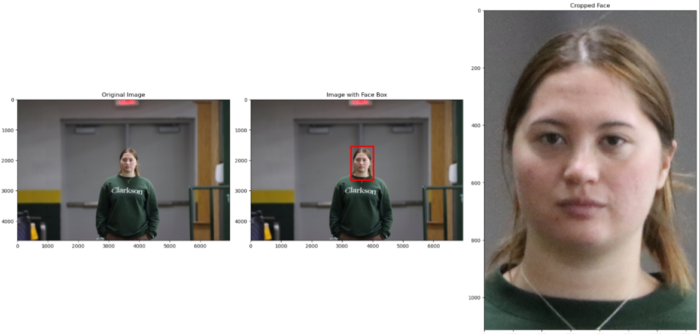

# Face Detection - YOLOv5 Custom

This repository demonstrates a custom face detection pipeline using a YOLOv5 model trained on manually annotated facial images. The goal is to detect faces in diverse conditions (indoor/outdoor, spoof/real/props) and save cropped face regions along with detection metadata into an Excel sheet.

## 🔍 Example Output

The figure below shows an example of:
- Original image
- Face detection bounding box using YOLOv5
- Cropped face result



---

## 📦 Project Goal

- Detect faces from structured image folders containing subject and session metadata.
- Crop detected faces using custom trained yolov5 model and store them.
- Generate a detailed Excel output with filename-based metadata and detection results.

---

## 🛠️ Setup Instructions

### 1. Clone YOLOv5 Repository

```bash
git clone https://github.com/ultralytics/yolov5
cd yolov5
```

### 2. Place Files

- Put custom trained `model/model.pt` file inside the `yolov5/` directory.
- Also place `src/face_detection.py` inside the same root (`yolov5/`).

### 3. Modify `face_detection.py`

Update the following:

- `root_folder = r'your\path\to\image_folder'`
- `output_folder = r'your\path\to\output_folder'`
- Update the model load path:
  ```python
  model = torch.hub.load('your/path/to/yolov5', 'custom', path='your/path/to/model.pt', source='local')
  ```

### 4. Install Dependencies

```bash
pip install -r requirements.txt
```

> RetinaFace is NOT used in this pipeline but mentioned as a requirement placeholder for flexibility:
```bash
pip install insightface
```

---

## 🚀 Run Detection

From within the `yolov5` folder:

```bash
python src/face_detection.py
```

---

## 📑 Excel Output

An Excel file `face_detection_details_yolov5.xlsx` will be saved inside the `output_folder`. It contains columns such as:

| subject number | image name | indoor/outdoor | device | distance | category | detection | face box coordinate | detection time (s) | input image size | cropped image size |
|----------------|-------------|----------------|--------|----------|----------|-----------|----------------------|---------------------|------------------|---------------------|
| 101            | 101_in_c_1m_live.JPG | Indoor | Camera | 1m | Live | Detected | 1200,400,1400,700 | 0.15 | 6400x4200 | 200x300 |

- These are parsed from filenames like: `101_in_c_1m_live.JPG`, `101_in_c_10m_live_propcat2.JPG`, `101_in_c_50m_spoof1_61.JPG`.

---

## 📂 Folder Structure Example

```
root_folder/
├── Subject_101/
│   ├── Camera/
│   │   ├── 101_in_c_1m_live.JPG
│   │   ├── 101_in_c_10m_live_propcat2.JPG
│   ├── Mobile/
│       └── 101_out_m_50m_spoof1_61.JPG
```

---

## ✅ Output Summary

- Cropped face images are saved in `output_folder`
- Metadata is saved in Excel format
- Detection is done using GPU if available (else falls back to CPU)

---

## ✍️ Annotations

- 758 face images were manually annotated using [this tool](https://github.com/mdzahirdu/image-annotation-tools).
- Used for training YOLOv5 to produce the `model.pt` file.

---

## 🔗 Citation

Please cite this repo if you use this face detection pipeline.

---
